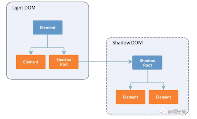

# shadow DOM
> - Shadow DOM是用于创建Web组件的主要技术之一，另外两个是自定义元素和HTML模板
> - Shadow DOM 将“封装”概念引入HTML,它允许你将隐藏的，分离的DOM链接到元素
> - > 这意味着你可以使用HTML和CSS的本地范围。现在可以用更通用的CSS选择器而不必担心命名冲突，并且样式不再泄漏或被应用于不恰当的元素
> - Shadow root 是 shadow 树中最顶层的节点，是在创建 shadow DOM 时被附加到常规DOM节点的内容。具有与之关联的shadow root的节点称为shadow host



## shadow DOM 的作用
> - Web 组件由三个主要技术组成，而shadow DOM是其中的关键部分
> - DOM开发中缺乏封装一直是个问题,Shadow DOM API为我们提供了划分DOM范围的能力，从而为这个问题提供了一个优雅的解决方案
> - 现在，样式冲突不再是一个令人担忧的问题，选择器也不会失控。 shadow DOM改变了小部件开发的游戏规则，能够创建从页面其余部分封装的小部件，并且不受其他样式表和脚本的影响，这是一个巨大的优势

## 创建一个shadow DOM
> - 要创建shadow DOM，需要用Element.attachShadow()方法将shadow root附加到元素
> - var shadowroot = element.attachShadow(shadowRootInit);
> - 要获取  shadowRoot  附加到的元素的引用，使用host属性
> - `console.log(shadowRoot.host)`
> - 要执行相反操作并获取对元素托管的shadow root的引用，可以用元素的shadowRoot属性
> - `console.log(elem.shadowRoot)`

## shadowRoot mod
> - 当调用Element.attachShadow()方法来附加shadow root时，必须通过传递一个对象作为参数来指定shadow DOM树的封装模式，否则将会抛出一个TypeError。该对象必须具有mode属性，其值为 open 或 closed
> - 打开的shadow root允许你使用host元素的shadowRoot属性从root外部访问shadow root的元素
> - 如果为closed，则尝试从root外部用JavaScript访问shadow root的元素时会抛出一个TypeError
> - 当mode设置为closed时，shadowRoot属性返回null。因为null值没有任何属性或方法，所以在它上面调用querySelector()会导致TypeError
> - shadowRoot.mode 可以获得shadow DOM是处于open还是closed

## 并非所有HTML元素都可以托管shadow DOM
> - 只有一组有限的元素可以托管shadow DOM。下表列出了支持的元素


> - 尝试将shadow DOM树附加到其他元素将会导致“DOMException”错误
> - 例如: `document.createElement('img').attachShadow({mode: 'open'})`

## 浏览器自动将shadow DOM附加到某些元素
> - hadow DOM已存在很长一段时间了，浏览器一直用它来隐藏元素的内部结构，比如: input、textarea、video
> - 当你在HTML中使用 video 元素时，浏览器会自动将shadow DOM附加到包含默认浏览器控件的元素。但DOM中唯一可见的是 video 元素本身
> - 设置chrome：Chrome DevTools设置（按F1），然后在“elements”部分下方选中“Show user agent shadow DOM”：


## 在自定义元素上托管shadow DOM
> - Custom Elements API 创建的自定义元素可以像其他元素一样托管shadow DOM
> - 有效的自定义元素不能是单个单词，并且名称中必须包含连字符 - 例如，myelement不能用作自定义元素的名称，并会抛出 DOMException 错误

```
  <my-element></my-element>
  <script>
    class MyElement extends HTMLElement {
      constructor() {
        super()
        // attach a shadow root to <my-element>
        const shadowRoot = this.attachShadow({mode: 'open'})
  
        shadowRoot.innerHTML = `
          <style>p {color: red}</style>
          <p>Hello</p>`
      }
    }
  
    // register a custom element on the page
    customElements.define('my-element', MyElement)
  </script>
```

## 样式化host元素
> - 通常，要设置host元素的样式，你需要将CSS添加到light DOM，因为这是host元素所在的位置。但是如果你需要在shadow DOM中设置host元素的样式呢？
> - 使用 :host{} 伪类函数，这个选择器允许从shadow root中的任何地方访问shadow host
```
注意：**:host{}仅在shadow root中有效，在shadow root之外定义的样式优先级高于:host中定义的样式**
例如，#host { font-size: 16px; } 的优先级高于 shadow DOM的 :host { font-size: 20px; }
实际上这很有用，这允许你为组件定义默认样式，并让组件的用户覆盖你的样式。唯一的例外是!important规则，它在shadow DOM中具有特殊性,
同时，可以将选择器作为参数传递给:host()，这允许你仅在host与指定选择器匹配时才会定位host。换句话说，它允许你定位同一host的不同状态
<style>
    :host(:focus) {
      /* style host only if it has received focus */
    }
    :host(.blue) {
      /* style host only if has a blue class */
    }
    :host([disabled]) {
      /* style host only if it's disabled */
    }
</style>
```

## 基于上下文的样式
> - 要选择特定祖先内部的shadow root host ，可以用:host-context()伪类函数
```
<body class="main">
    <div id="host">
    </div>
</body>
:host-context(.main) { font-weight: bold;}
// 只有当它是.main的后代时，此CSS代码才会选择shadow host
:host-context()对主题特别有用，因为它允许作者根据组件使用的上下文对组件进行样式设置
```

## 样式钩子
> - shadow DOM的一个有趣地方是它能够创建“样式占位符”并允许用户填充它们。这可以通过使用CSS自定义属性来完成
```
  <div id="host"></div>
  <style>
    #host {--size: 20px;}
  </style>
  <script>
    const elem = document.querySelector('#host');
    const shadowRoot = elem.attachShadow({mode: 'open'});
    shadowRoot.innerHTML = `
      <p>Shadow DOM</p>
      <style>p {font-size: var(--size, 16px);}</style>`;
  </script>
```

## 可继承的样式
> - shadow DOM允许创建独立的DOM元素，而不会从外部看到选择器可见性，但这并不意味着继承的属性不会通过shadow边界
> - 某些属性（如color，background和font-family）会传递shadow边界并应用于shadow树。因此，与iframe相比，shadow DOM不是一个非常强大的障碍
> - 解决办法: 解决方法很简单：通过声明all: initial将可继承样式重置为其初始值
> - > 元素被强制回到初始状态，因此穿过shadow边界的样式不起作用

## 重新定位事件
> - 在shadow DOM内触发的事件可以穿过shadow边界并冒泡到light DOM
> - 但是Event.target的值会自动更改，因此它看起来好像该事件源自其包含的shadow树而不是实际元素的host元素
> - 此更改称为事件重定向，其背后的原因是保留shadow DOM封装
```bash
  <div id="host"></div>

  <script>
    const elem = document.querySelector('#host')
    const shadowRoot = elem.attachShadow({mode: 'open'})

    shadowRoot.innerHTML = `
      <ul>
        <li>One</li>
        <li>Two</li>
        <li>Three</li>
      <ul>
    `

    document.addEventListener('click', e => {
      console.log(e.target)
    }, false)
  </script>
  // 当单击shadow DOM中的任何位置时，这段代码会将 <div id =“host”> ... </div> 记录到控制台，因此侦听器无法看到调度该事件的实际元素

  // 但是在shadow DOM中不会发生重定目标，可以轻松找到与事件关联的实际元素,修改如下
  shadowRoot.querySelector('ul').addEventListener('click', e => {
    console.log(e.target)
  }, false)
```
> - 注意: 并非所有事件都会从shadow DOM传播出去。那些做的是重新定位，但其他只是被忽略了。如果你使用自定义事件的话，则需要使用composed:true标志，否则事件不会从shadow边界冒出来
